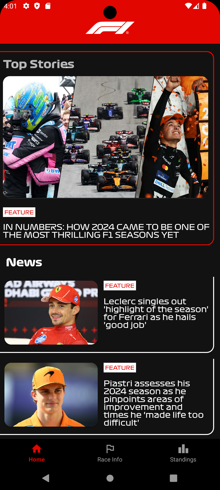
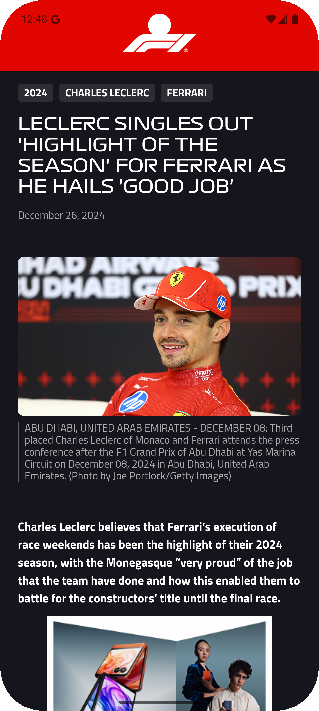
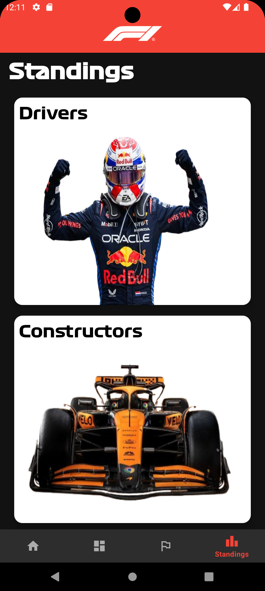
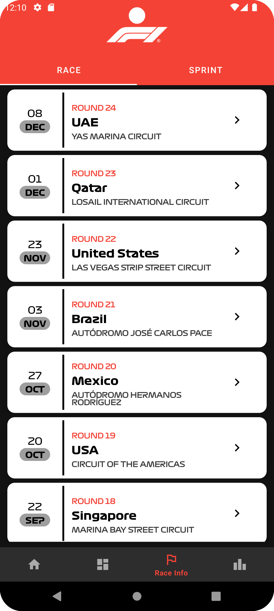
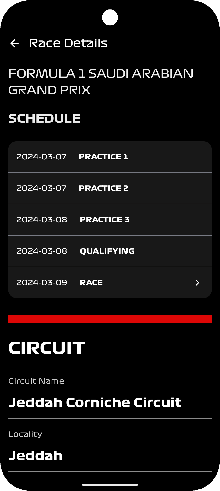
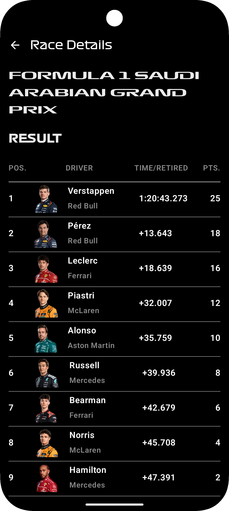
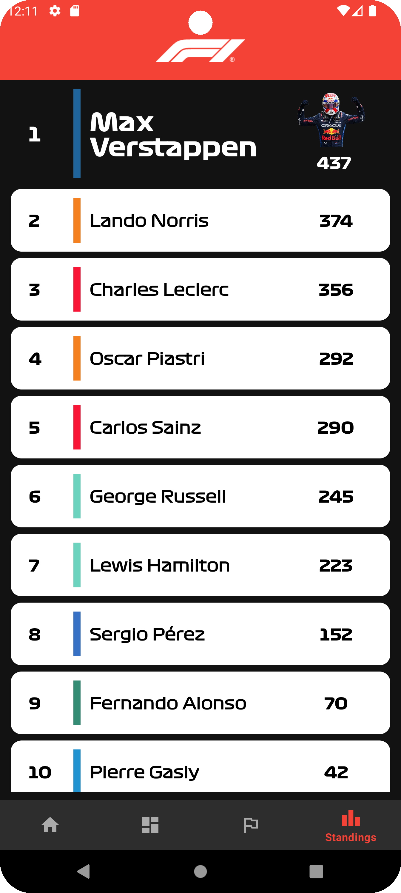
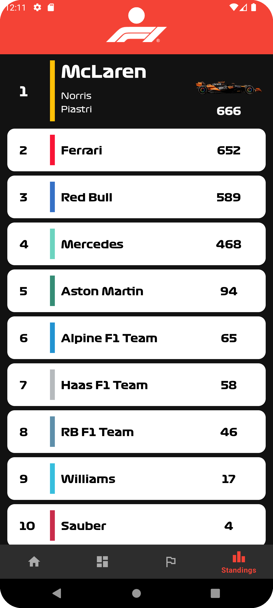
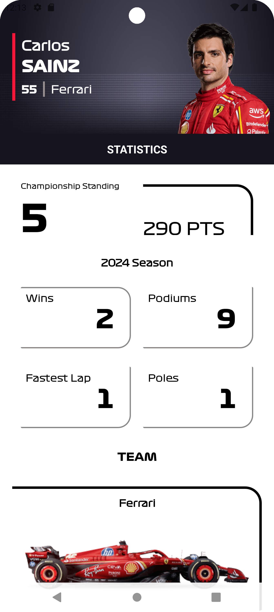
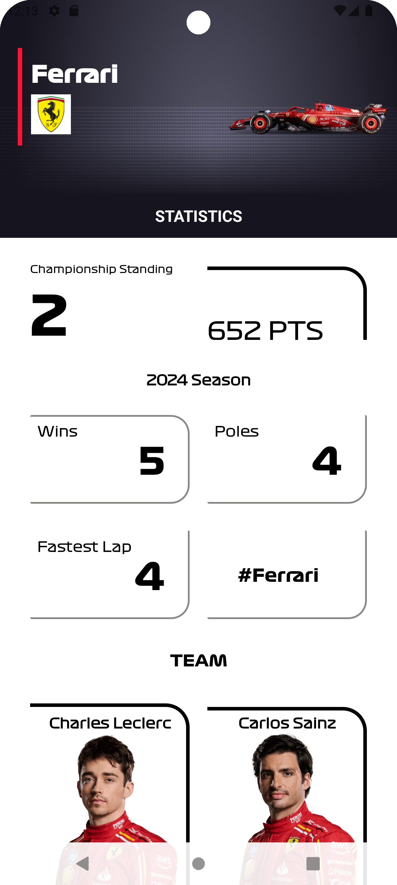

# F1 Racing App

## Overview
The F1 Racing App provides users with the latest F1 race calendar, news, driver standings, and race statistics. The app fetches real-time data using Retrofit API and Firebase Realtime Database, processing over 500+ API requests daily. This app is built with **Java**, **MVVM architecture**, and **Firebase** to ensure a robust and scalable solution.

## Features
- **Real-time Data**: Fetches race schedules, driver standings, news, and race statistics using the **Retrofit API**.
- **MVVM Architecture**: Utilizes the **MVVM (Model-View-ViewModel)** architecture to maintain clear separation of concerns and ensure scalability.
- **LiveData**: Implements **LiveData** to observe changes in race data and update the UI in real time.
- **Firebase Integration**: Stores and syncs race data and user preferences using **Firebase Realtime Database**.
- **Seamless UI**: The app provides a smooth and visually appealing user interface that ensures a user-friendly experience.
- **High API Request Volume**: Handles over 500+ API requests daily to fetch live data, ensuring real-time updates.

## Screenshots

  
  
  

 

  
  
  

 

  
  
  

  
 

## Technologies Used
- **Programming Languages**: Java
- **Architecture**: MVVM, Repository Pattern
- **Networking**: Retrofit
- **Database**: Firebase Realtime Database
- **UI**: XML Layouts, Custom Views
- **LiveData**: For observing changes in data
- **Firebase**: For storing race and user data

## Future Enhancements
- **User Authentication**: Integrate Firebase Authentication for personalized user experience, allowing users to save their preferences and follow specific drivers or teams.
- **Push Notifications**: Implement push notifications to keep users informed about race results, breaking news, and race reminders.
- **Improved UI/UX**: Enhance the user interface with animations and smooth transitions for a more dynamic and engaging experience.
- **Additional Features**: Add a feature for users to view past race statistics and results.
